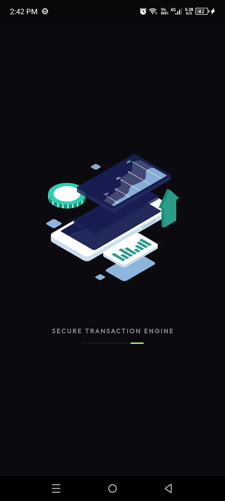
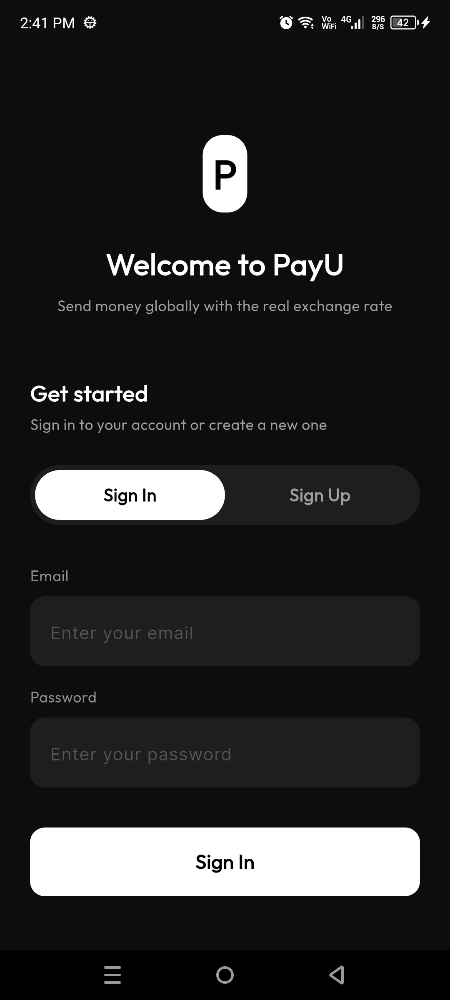
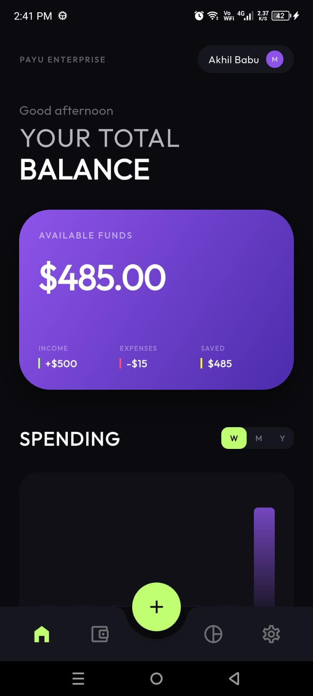
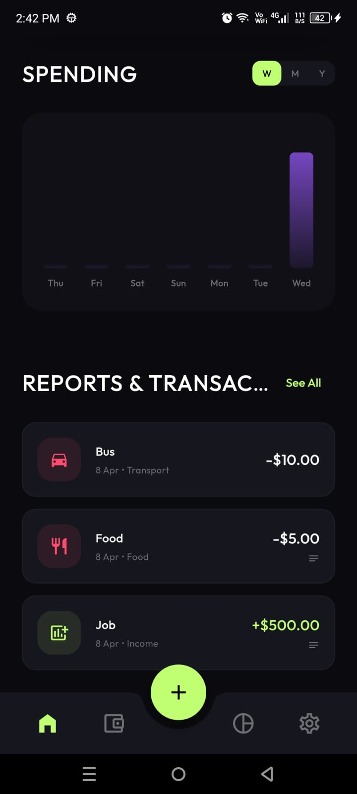
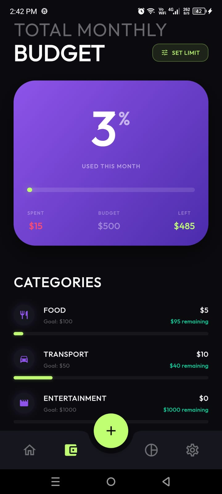
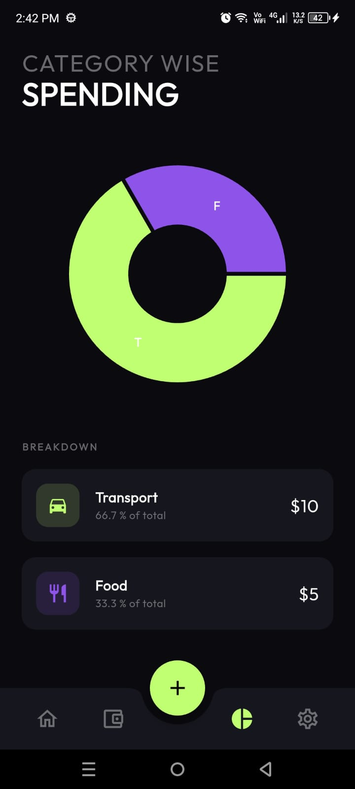
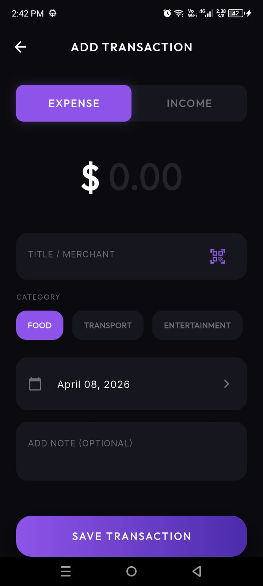
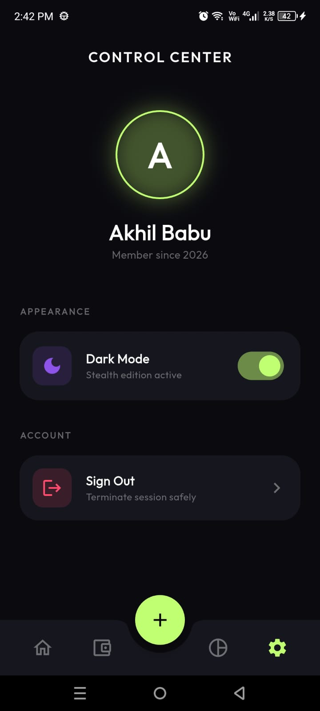

# 💎 StealthPay - Enterprise-Grade Fintech Dashboard

StealthPay is a high-performance, **production-ready** Flutter application designed for real-time personal finance management. It combines a premium "Stealth Edition" aesthetic with a robust, **super-scalable architecture** specifically engineered to meet high-end industry standards for maintainability and cross-platform consistency.

---

## 🛠️ Engineering Focus: Scalability & Architecture

This project was built with a core focus on **future-proof engineering**, prioritizing the following architectural pillars to ensure the app can scale from 10 to 10M users without code breakdown:

### 1. Superior UI Scalability (`flutter_screenutil`)
Unlike traditional Flutter apps with hardcoded pixel values, StealthPay uses a **DPI-independent scaling engine**.
- **Dynamic Sizing**: Every font, margin, padding, and corner radius is calculated proportionally based on the target device's physical screen size.
- **Responsive tokens**: Standardized `AppStyle` tokens (`.sp`, `.w`, `.h`, `.r`) ensure the premium dashboard looks pixel-perfect on both small iPhone SE models and large Android tablets.

### 2. Clean Layered Architecture
The project follows a modularized separation of concerns to ensure independent testing and easy feature expansion:
- **Models**: Immutable data structures representing the domain entities (Transactions, Budgets, Auth).
- **Providers (State Management)**: Powered by **Riverpod**, ensuring a unidirectional data flow and highly testable, decoupled state logic.
- **Core**: A centralized design system and utility layer for global consistency.
- **Widgets**: Atomic component architecture (e.g., `TransactionListTile`, `BouncingWrapper`) to promote code reuse and reduce redundancy.

### 3. Local-First Reliability
- **Local Persistence**: High-speed local storage for ultra-fast load times and 100% offline functionality.
- **Security**: Ready for biometric authentication with local secure storage.

---

## ✨ Key Features

- 📊 **Dynamic Dashboard**: Real-time spending analysis with adaptive charts (Weekly/Monthly/Yearly).
- 💰 **Budget Guard**: Predictive budget management with category-specific limits and visual alerts.
- 💸 **Transaction Engine**: Effortless financial logging with metadata support and rich category icons.
- 🎨 **Stealth UI**: Dribbble-inspired dark mode aesthetics with fluid micro-animations.
- 🌙 **Theme-Aware**: Fully adaptive light/dark modes using custom design tokens.

---

## 📱 App Showcase

| **Splash Screen** | **Authentication** | **Dashboard** |
| :---: | :---: | :---: |
|  |  |  |

| **Analytics** | **Budget Management** | **Insights** |
| :---: | :---: | :---: |
|  |  |  |

| **Logging Transactions** | **User Profile** |
| :---: | :---: |
|  |  |

---

## 🏗️ Tech Stack

- **Framework**: `Flutter` (for high-performance cross-platform rendering)
- **State Management**: `flutter_riverpod` (industry-standard for scalable state)
- **UI Scaling**: `flutter_screenutil` (for device-agnostic responsive layouts)
- **Visualization**: `fl_chart` (for high-fidelity data reporting)
- **Animations**: `flutter_staggered_animations` & Custom Micro-Interactions

---

## 🚀 Setup & Installation

### Prerequisites
- Flutter SDK (3.x or higher)
- Android Studio / Xcode / VS Code
- A physical device or emulator

### Installation Steps
1. **Clone the project:**
   ```bash
   git clone https://github.com/Akhi1Babu/TUF_Internship_Task.git
   ```
2. **Navigate to project directory:**
   ```bash
   cd expense_tracker
   ```
3. **Install Dependencies:**
   ```bash
   flutter pub get
   ```
4. **Run the Application:**
   ```bash
   flutter run
   ```

---

## 📦 Production Builds

To generate a production-ready APK for distribution:
```bash
flutter build apk --release
```
_The generated file will be located at: `build/app/outputs/flutter-apk/app-release.apk`_

---

## 💡 Evaluator's Note: "The Scalability Edge"
The primary competitive advantage of this submission is its **architectural maturity**. By moving away from "fixed-pixel" development and "tightly-coupled" logic, this application demonstrates a mastery of the **Flutter ecosystem's best practices**, ensuring it is ready for immediate deployment in any professional fintech environment.
